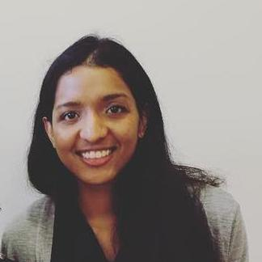

---

# Research
During my Ph.D., I focused on a class of _proactive_ congestion control algorithms for the Internet, where network switches 
co-ordinate to rapidly figure out how to share bandwidth among different applications. I have also worked on tools for programming 
reconfigurable switches. Previously, as un undergraduate, I worked on techniques to measure Internet traffic at line rate in hardware.

<!---- **A distributed algorithm to compute max-min fair rates without per-flow state.**  
_L. Jose*, S. Ibanez , M. Alizadeh, N. McKeown_ 
(accepted) at SIGMETRICS 2019.--->
- **Proactive Congestion Control.**  
_L. Jose_  
[(Thesis)](https://searchworks.stanford.edu/) (Code coming soon) (Defense slides coming soon) 
- **High Speed Networks Need Proactive Congestion Control.**  
_L. Jose*, L. Yan, M. Alizadeh, G. Varghese, N. McKeown, S. Katti_ 
at HotNets 2015.  
[(Paper)](assets/perc-hotnets15.pdf) [(Code)](https://bitbucket.org/lavanyaj/perc/overview) [(Slides in .pptx)](assets/perc-hotnets15_slides.pptx) [(Slides in .pdf)](assets/perc-hotnets15_slides.pdf) (Talk available [here](https://dl.acm.org/citation.cfm?id=2834096) with ACM Digital Library Subscription, check under Source Materials)  
- **Compiling Packet Programs to Reconfigurable Switches.** 
_L. Jose*, L. Yan, G. Varghese, N. McKeown_ at NSDI 2015.  
[(Paper)](assets/compiling15.pdf) [(Code)](https://bitbucket.org/lavanyaj/switch-compiler) [(Slides in .pptx)](assets/compiling15_slides.pptx)  [(Slides in .pdf)](assets/compiling15_slides.pdf) [(Talk)](https://www.usenix.org/conference/nsdi15/technical-sessions/presentation/jose) 
- **Software Defined Traffic Measurement with OpenSketch.**  
_M. Yu, L. Jose, R. Miao_ at NSDI 2013.  
[(Paper)](assets/opensketch12.pdf) [(Code)](https://github.com/harvard-cns/opensketch) [(Slides in .pdf)](assets/opensketch12_slides.pdf) [(Talk)](https://www.usenix.org/conference/nsdi13/software-defined-traffic-measurement-opensketch) 
- **Online measurement of large traffic aggregates on commodity switches.**  
_L. Jose*, M. Yu, and J. Rexford_ at HotICE 2011.  
[(Paper)](assets/hhh10.pdf) [(Code)](https://github.com/lavanyaj/hhh) [(Slides in .pdf)](assets/hhh10.pdf)

(* indicates that I was the lead student on this project)

# Invited Talks
  - Dagstuhl Seminar 16281 on Network Latency Control in Data Centres in July, 2016.  
  [(Slides in .pdf)](assets/PERC_Dagstuhl_July2016.pptx)
  - NSF Algorithms in the Field (AiTF) Workshop on Algorithms for Software-Defined Networking in June, 2016.  
  [(Talk)](https://www.youtube.com/watch?v=zgoW_iIuubI&t=0s&index=27&list=PLqxsGMRlY6u7BhnI6JxShJHj_tYg-i1Qh) [(Slides in .pptx)](assets/PERC_NSF_AITF_June2016.pptx)
  - MSR Student Summit on Mobility, Systems, and Networking in January, 2016.  
  [(Slides in .pptx)](assets/MSR_StudentSummit_June2016.pptx)

# Contact
- You can e-mail me at lavanyaj (at) cs (dot) stanford (dot) edu
- You can also find me on [LinkedIn](https://www.linkedin.com/in/lavanya-jose), [GitHub](https://www.github.com/lavanyaj/), and [Bitbucket](https://bitbucket.org/lavanyaj/).

# Personal
- Advice on thriving at an American college as an international student [(Blog post)](https://medium.com/@lavanya.jose/an-international-students-guide-to-thriving-at-an-american-college-edf6150b990d)
- Favorite writing samples from the Daily Princetonian: On People ([John Dabiri](http://theprince.princeton.edu/princetonperiodicals/?a=d&d=Princetonian20091109-01.2.5), [Merrily Baker](http://theprince.princeton.edu/princetonperiodicals/?a=d&d=Princetonian20091015-01.2.6)), On Careers ([Firefighting](http://theprince.princeton.edu/princetonperiodicals/?a=d&d=Princetonian20100204-01.2.7), [Religious](http://theprince.princeton.edu/princetonperiodicals/?a=d&d=Princetonian20091021-01.2.8)) (Crazy fact: you can go all the way back to archives from [1892](http://theprince.princeton.edu/princetonperiodicals/?a=d&d=NassauLit18420201-01))
- My first name is pronounced like "Lavinia" and is a Sanskrit word, which means "grace" or "beauty". My last name is pronounced like "Joe's", and has its [origins](https://en.wikipedia.org/wiki/Saint_Thomas_Christian_names) in the Bible.
- Apparently, you can also find information about me in an inordinate number of distributed systems including those at [Twitter](https://twitter.com/lavya), [Goodreads](https://www.goodreads.com/user/show/3940197-lavanya), [Yelp](https://www.yelp.com/user_details?userid=buA-TqGw0XrnoQJuekKvvw), [Meetup.com](https://www.meetup.com/members/104786062/), [Flickr](https://www.flickr.com/photos/91997573@N02), [Whatsapp](https://www.whatsapp.com/), [Venmo](https://venmo.com/), [Spotify](https://www.spotify.com/us/), [Pandora](https://www.pandora.com/), [SoundCloud](https://soundcloud.com/lavanyaj), [Square](https://squareup.com/us/en), [Google](https://www.google.com), [Apple](https://www.apple.com), [Amazon](https://www.amazon.com), [Pinterest](https://www.pinterest.com/lavanyajose/) and various third-parties I don't know about (when did I ever find the time, and apologies to anyone I missed..)

