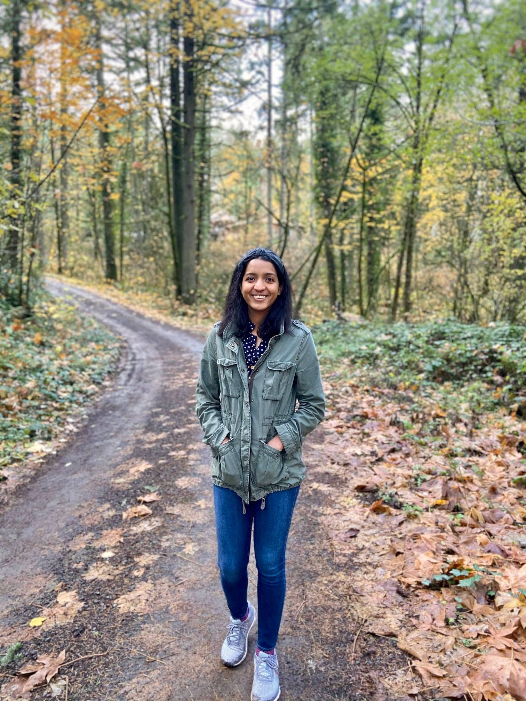

---

I am a _Senior Software Engineer_ at Google. I work on network traffic management for Google's wide-area network (WAN). Specifically, I work in the [Bandwidth Enforcer](https://conferences.sigcomm.org/sigcomm/2015/pdf/papers/p1.pdf) team, which computes and enforces bandwidth allocations on Google's WAN to meet various business policies. 

My research interests are in wide-area networking, congestion control, software-defined networks and programmable networks. I am excited about developing large-scale, simple, and practical systems, which are grounded in theory.

Prior to joining Google in 2019, I received a Ph.D. in Computer Science from Stanford University 🌲, where I was advised by Professor [Nick McKeown](http://klamath.stanford.edu/~nickm/index.html). During my Ph.D., I explored a class of <i> proactive </i> congestion control algorithms for the Internet and datacenters, where network switches co-ordinate to rapidly figure out how to share bandwidth among different applications.  
Before that, I received my B.S.E. in Computer Science from Princeton University 🐅, where I discovered computer science research, and I was fortunate to be advised by Professors [Jennifer Rexford](https://www.cs.princeton.edu/~jrex/), [Moses Charikar](https://profiles.stanford.edu/moses-charikar) and [Christiane Fellbaum](https://www.cs.princeton.edu/~fellbaum/). At Princeton, I developed techniques to measure Internet traffic at line rate in hardware, and worked to improve [WordNet](https://wordnet.princeton.edu/), a lexical database of English widely used in computational linguistics.

# Service
- Program Committee Member and Session Chair for [ACM/IEEE Symposium on Architectures for Networking and Communications Systems 2021 (ANCS'21)](https://ancsconf.org/)
- Reviewer for IEEE/ACM Transactions on Networking 2018 and 2019, IEEE Transactions on Parallel and Distributed Systems 2020, IEEE Transactions on Network and Service Management 2021

# Honors
- Runner-Up for [Outstanding Undergraduate Researcher Award](https://cra.org/about/awards/outstanding-undergraduate-researcher-award/#2012) from CRA in 2012
- Finalist for Facebook PhD Fellowship, 2016 and Microsoft Research PhD Fellowship 2013

## Publications
- **A Distributed Algorithm to Calculate Max-Min Fair Rates Without Per-Flow State.**  
_L. Jose*, [S. Ibanez](https://web.stanford.edu/~sibanez/) , [M. Alizadeh](https://people.csail.mit.edu/alizadeh/), [N. McKeown](http://yuba.stanford.edu/~nickm/)_   
 presented at SIGMETRICS 2019 / published in POMACS 2019.  
 [(Full Paper)](assets/s-perc_pomacs19_paper.pdf) [(Extended Abstract)](assets/s-perc_sigmetrics19_paper.pdf) [(Code)](https://github.com/lavanyaj/perc) [(Slides in .pptx)](assets/s-perc_sigmetrics19_slides.pptx) [(Slides in .ppt)](assets/s-perc_sigmetrics19_slides.ppt) [(Slides in .pdf)]()  (Talk not recorded, please see speaker notes accompanying .pptx slides)
- **High Speed Networks Need Proactive Congestion Control.**  
_L. Jose*, [L. Yan](http://stanford.edu/~yanlisa/), [M. Alizadeh](https://people.csail.mit.edu/alizadeh/), [G. Varghese](https://web.cs.ucla.edu/~varghese/), [N. McKeown](http://yuba.stanford.edu/~nickm/), [S. Katti](https://web.stanford.edu/~skatti/)_   
presented at HotNets 2015.  
[(Paper)](assets/perc-hotnets15.pdf) [(Code)](https://bitbucket.org/lavanyaj/perc/overview) [(Slides in .pptx)](assets/perc-hotnets15_slides.pptx) [(Slides in .pdf)](assets/perc-hotnets15_slides.pdf)  (Talk available [here](https://dl.acm.org/citation.cfm?id=2834096) with ACM Digital Library Subscription, check under Source Materials)  
- **Compiling Packet Programs to Reconfigurable Switches.**  
_L. Jose*, [L. Yan](http://stanford.edu/~yanlisa/), [G. Varghese](https://web.cs.ucla.edu/~varghese/), [N. McKeown](http://yuba.stanford.edu/~nickm/)_   
presented at NSDI 2015.  
[(Paper)](assets/compiling15.pdf) [(Code)](https://bitbucket.org/lavanyaj/switch-compiler) [(Slides in .pptx)](assets/compiling15_slides.pptx)  [(Slides in .pdf)](assets/compiling15_slides.pdf) [(Talk)](https://www.youtube.com/watch?v=xd6qWLuKWCU) 
- **Software Defined Traffic Measurement with OpenSketch.**  
_[M. Yu](http://minlanyu.seas.harvard.edu/), L. Jose, [R. Miao](https://www.linkedin.com/in/rui-miao-90b51944)_   
presented at NSDI 2013.  
[(Paper)](assets/opensketch12.pdf) [(Code)](https://github.com/harvard-cns/opensketch) [(Slides in .pdf)](assets/opensketch12_slides.pdf) [(Talk)](https://www.youtube.com/watch?v=DI7tcE6NfuY) 
- **Online measurement of large traffic aggregates on commodity switches.**  
_L. Jose*, [M. Yu](http://minlanyu.seas.harvard.edu/), and [J. Rexford](http://www.cs.princeton.edu/~jrex/)_   
presented at HotICE 2011.  
[(Paper)](assets/hhh10.pdf) [(Code)](https://github.com/lavanyaj/hhh) [(Slides in .pptx)](assets/hhh-hotice11.pptx) [(Slides in .pdf)](assets/hhh10.pdf)  (Talk not recorded, please see speaker notes accompanying .pptx slides)

(* indicates that I was the lead student on this project)
## Ph.D. Thesis
- **Proactive Congestion Control.**  
_L. Jose_  
[(Thesis)](https://searchworks.stanford.edu/view/13092396) [(Acks)](assets/acks.pdf) 

## Invited Talks
  - Dagstuhl Seminar 16281 on Network Latency Control in Data Centres in July, 2016.  
  [(Slides in .pdf)](assets/PERC_Dagstuhl_July2016.pptx)
  - NSF Algorithms in the Field (AiTF) Workshop on Algorithms for Software-Defined Networking in June, 2016.  
  [(Talk)](https://www.youtube.com/watch?v=zgoW_iIuubI&t=0s&index=27&list=PLqxsGMRlY6u7BhnI6JxShJHj_tYg-i1Qh) [(Slides in .pptx)](assets/PERC_NSF_AITF_June2016.pptx)
  - MSR Student Summit on Mobility, Systems, and Networking in January, 2016.  
  [(Slides in .pptx)](assets/MSR_StudentSummit_June2016.pptx)

# Contact
- You can e-mail me at lavanyaj (at) cs (dot) stanford (dot) edu or lav (at) google (dot) com.
- You can also find me on [LinkedIn](https://www.linkedin.com/in/lavanya-jose), [GitHub](https://www.github.com/lavanyaj/), and [Bitbucket](https://bitbucket.org/lavanyaj/).

# Personal
- Advice on thriving at an American college as an international student [(Blog post)](https://medium.com/@lavanya.jose/an-international-students-guide-to-thriving-at-an-american-college-edf6150b990d)
- Favorite writing samples from the Daily Princetonian: On People ([John Dabiri](http://theprince.princeton.edu/princetonperiodicals/?a=d&d=Princetonian20091109-01.2.5), [Merrily Baker](http://theprince.princeton.edu/princetonperiodicals/?a=d&d=Princetonian20091015-01.2.6)), On Careers ([Firefighting](http://theprince.princeton.edu/princetonperiodicals/?a=d&d=Princetonian20100204-01.2.7), [Religious](http://theprince.princeton.edu/princetonperiodicals/?a=d&d=Princetonian20091021-01.2.8)) (Crazy fact: you can go all the way back to archives from [1892](http://theprince.princeton.edu/princetonperiodicals/?a=d&d=NassauLit18420201-01))
- My first name is pronounced like "Lavinia" and is a Sanskrit word, which means "grace" or "beauty". My last name is pronounced like "Joe's", and has its [origins](https://en.wikipedia.org/wiki/Saint_Thomas_Christian_names) in the Bible.

